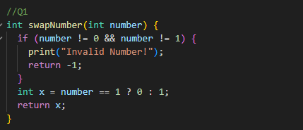
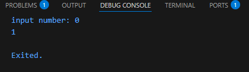
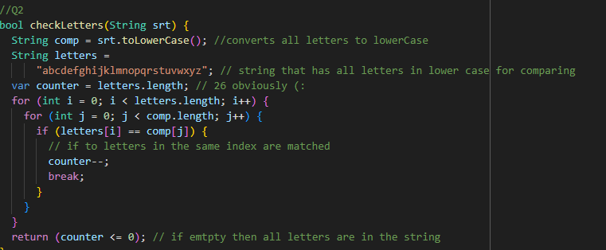
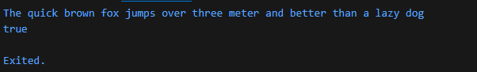
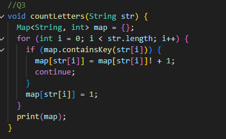
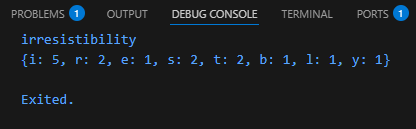
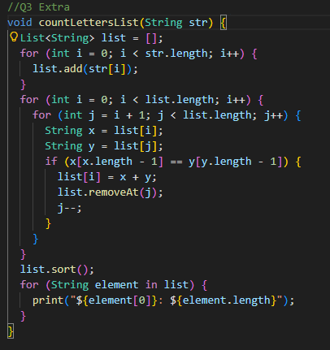
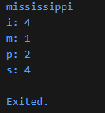

# This is the first homework in the Flutter Bootcamp

**Question 1:** Write a function that replaces 0 with 1 and vice versa.

**Question 2:**  Write a function that receives a string and check if it has all letters.

**Question 3:** Write a functions thar counts the occurrencec of each letter and prints the resulting map.

**Extra Question:** Write another function that uses a list.

